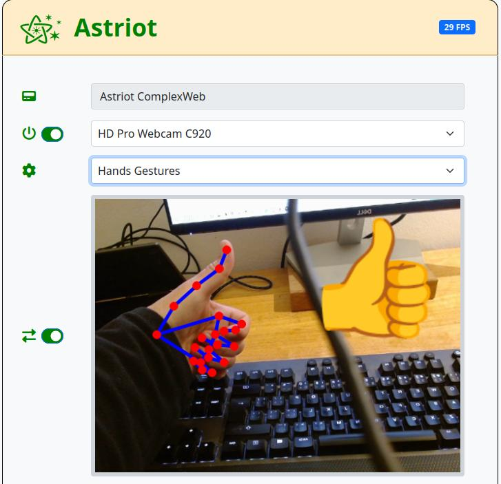

# Hi there! I'm Ivo Marvan 👋

I am a Python engineer with a passion for AI, AI-driven development, concurrency, and image processing.

I also have extensive experience in developing hardware and software prototypes, specializing in C/C++ for ESP32 & ESP-IDF. 
I enjoy working with communication protocols like CAN Bus, UART, I2C, and SPI, and integrating various sensors and devices such as GPS, LiDAR, etc.

---

## 🛠️ Featured Projects

Here is a curated list of projects I have designed and built:

### [Agentflow-kit](https://github.com/ivomarvan/agentflow-kit)

A lightweight, educational framework for building LLM agent workflows using a declarative state graph with deterministic Bulk Synchronous Parallel (BSP) execution. 

This project demonstrates a deep understanding of complex AI orchestration by solving the notorious "black box" debugging problem common in modern agent frameworks. By enforcing strict immutability and predictable execution cycles, it provides a robust, testable, and transparent architecture.
* **Deterministic Execution:** Uses a fixed Compute → Barrier → Apply cycle (BSP model) for predictable and reproducible agent traces.
* **Immutable State:** State is a frozen dataclass with explicit patches and typed reducers, preventing parallel nodes from silently overwriting each other.

 

---

### [Cursor Best Practices Template](https://github.com/ivomarvan/cursor-best-practices-template)

A shared Cursor IDE configuration library containing curated `.mdc` rules and agent skills that enforce consistent coding standards and best practices across projects.

* **Agentic Project Management (APM):** Implements a structured workflow dividing AI tasks into roles: **Planner** (high-context reasoning models), **Coder** (fast implementation models), and **Human** (Tech Lead oversight).
* **Automated Quality:** Enforces strict boundaries, Clean Code, SOLID principles, automated linting/formatting (Ruff, ESLint), and strict type checking.

 

---

### [Veilgit](https://github.com/ivomarvan/veilgit)

A Python tool that adds transparent file encryption to any git repository — selected files stay readable locally but are encrypted before they reach the remote repository.

* **How it works:** Leverages git's native `clean`/`smudge` filter mechanism using [age](https://github.com/FiloSottile/age) encryption — you use git exactly as before, requiring no workflow changes.
* **Key Features:** Pattern-based file selection, multi-recipient collaboration, ensures only encrypted data is stored in the git history (plaintext never leaves your machine), and an interactive setup wizard with multi-language support (EN, DE, FR, ES, CS, PL).

 

---

### [Concurrent Harmony](https://github.com/ivomarvan/ConcurrentHarmony)

*Where Threads and Processes Sing Together.* A comprehensive Python framework for managing concurrency in applications involving multiple processes and threads.

* **Real-world Origin:** Developed for high-parallelism sensor data logging (GPS, CAN bus, rangefinder) on Raspberry Pi 4b aboard drones at [Zuri.com](https://zuri.com), with the kind permission of Michal Illich.
* **Key Features:** Supports multi-threading/multi-processing, advanced signal management (standard & user-defined signals), state persistence via files, and Tkinter-based GUI integration for process control.

 

---

### [Astriot](https://github.com/ivomarvan/astriot)

*Affordable image processing for assistive technologies.* A concept and library designed to extract facial and body pose data, providing text outputs via an API.

* **Live Demo / Info:** Visit the [Astriot Website](https://ivomarvan.github.io/astriot/)
* **Purpose:** Enables affordable, lightweight image processing for accessibility and other sensor-driven applications.

 

---

### [idf-can-bus (ESP32 + CAN Bus Solutions)](https://github.com/idf-can-bus)

A dedicated GitHub organization containing a collection of modular, production-ready CAN libraries for ESP32 platforms using ESP-IDF.

* **[can-multibackend-idf](https://github.com/idf-can-bus/can-multibackend-idf):** Multi-Backend CAN Example Suite. Seamlessly switch between built-in TWAI and external MCP25xxx controllers over SPI.
* **[twai-idf-can](https://github.com/idf-can-bus/twai-idf-can):** Simplified high-level adapter for ESP32's built-in TWAI (CAN) controller with automatic error recovery.
* **[mcp25xxx-multi-idf-can](https://github.com/idf-can-bus/mcp25xxx-multi-idf-can):** Extended CAN driver supporting multiple MCP2515 controllers over SPI.
* **[examples-utils-idf-can](https://github.com/idf-can-bus/examples-utils-idf-can):** Common utility functions shared across the CAN examples.

 

---
